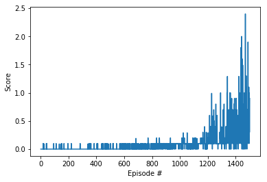

# Report

### Learning Algorithm
The agents learn through the Deep Deterministic Policy Gradients (DDPG) algorithm augmented to account for multiple agents: MADDPG. The implementation of the MADDPG algorithm is based on the research paper [
Multi-Agent Actor-Critic for Mixed
Cooperative-Competitive Environments](https://arxiv.org/pdf/1706.02275.pdf). 

MADDPG can be seen as an actor critic method and as an extension of the DDPG algorithm for multiple agents. The agents can interact in a cooperative or in a competitive manner. This is achieved in the following way. All agents have a common critic and their individual actors. Optimization is done individually for each agent with it's associated rewards. More concretely the agent's actor is optimized just as in the DDPG algorithm, and the weights of the critic which are associated with the agent's action inputs are trained for each agent separately with the respective rewards.
  
The model architecture for the actor and for the critic is to use a local and a target nerual network for each. Each network has two hidden layers. All layers are fully connected, using ReLu activation for the hidden layers, and tanh activation for the actor's output layer as well as linear activation for the critic's output layer. The exploration aspect is modeled by applying decaying Ornstein-Uhlenbek noise to the chosen action. Since the agents have local state, the state input to the critic is the union of all the states the agents receive.
  
The following hyperparameters are used:
* size of first hidden layer (actor and critic): 512
* size of second hidden layer (actor and critic): 512
* replay buffer size: BUFFER_SIZE = int(1e6)
* minibatch size: BATCH_SIZE = 256
* discount factor: GAMMA = 0.99
* soft update factor TAU = 1e-3
* learning rate actor: LR_ACTOR = 1e-3
* learning rate critic: LR_CRITIC = 1e-3
* L2 weight decay: WEIGHT_DECAY = 0
* initial scale of noise (hardcoded): 1
* linear noise decay: EPSILON_DECAY = 1e-6

### Training Results
The trained agent solved the environment in 1501 episodes. The following plot shows the average score per episode:

### Ideas for Future Work
* Extending different technique than DDPG to the multi agent case could be explored. Various tachniques are benchmarked in [this paper](https://arxiv.org/abs/1604.06778)
* Improving the MADDPG implementation: Using parameter noise instead of action noise. Advantages of the former are described in this [blog post by OpenAI](https://blog.openai.com/better-exploration-with-parameter-noise/)
* Improving the MADDPG implementation: using [prioritized experience replay](https://arxiv.org/abs/1511.05952)
